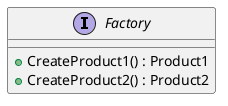
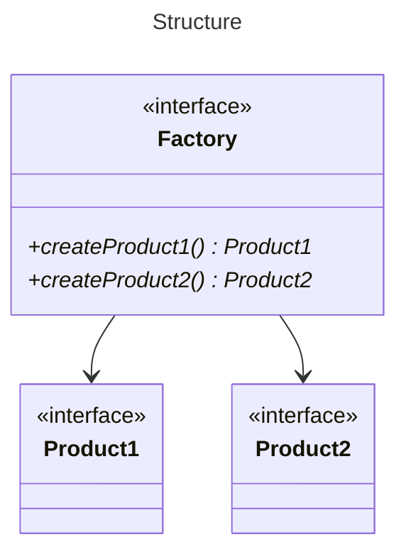
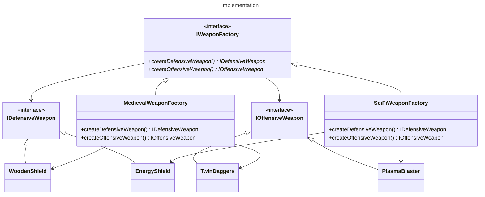

# Abstract Factory
### Purpose
- Abstract the creation of a family of objects
- Multiple factories can be used to swap which family of objects will be created
- A single factory is still useful to abstract creation so that it can be mocked

### Diagram

### Sources
* [Source Making](https://sourcemaking.com/design_patterns/abstract_factory)
